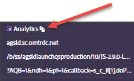

# ネットワーク情報 {#network-information}

ネットワーク情報を表示するには、**[!UICONTROL Network]** をクリックします。

ネットワーク画面は、ページでのすべての Adobe Experience Cloud ソリューション呼び出しを集計して、左から右の順に表示します。標準パラメーターは、わかりやすい名前で自動的にラベル付けされ、同じ役割の共通パラメーターにグループ化されて配置されます。

>[!TIP]
>
>この画面は、Experience Cloud 訪問者 ID や追加データ IDなど、統合に使用されたパラメーターが統合内で一貫していることを確認するのに便利です。

>[!NOTE]
>
>この時点では、ソリューション呼び出し（例えば、Analytics コンテキスト変数、Target カスタムパラメーター、Experience Cloud ID サービス顧客 ID）に渡されたすべてのパラメーターがネットワーク画面に表示されているわけではありません。

すべての情報を表示するには、**[!UICONTROL All]**&#x200B;を選択します。

また、ソリューションで情報をフィルタリングすることもできます。表示するソリューションを選択します。同時に複数のソリューションを表示できます。選択したソリューションフィルターがハイライト表示されます。

ネットワーク表示の項目をクリックすると、大きく表示されます。展開された表示ウィンドウから、表示された情報をクリップボードにコピーできます。

各列の上部にあるアイコンを使用して、サーバー呼び出し URL をクリップボードにコピーし、参照用またはデバッグ用に別のドキュメントに貼り付けることができます。

