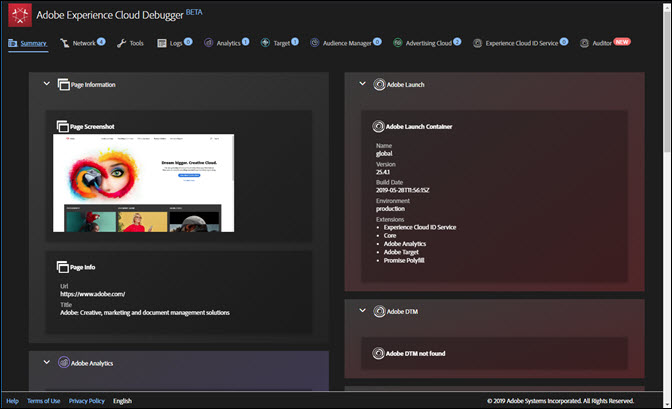

# 概要画面 {#summary-screen}

Adobe Experience Cloud Debugger を実行するには、拡張機能バーにある拡張機能アイコンをクリックし、Chrome で調べたいページを開きます。

 Experience Cloud Debugger サマリ画面が表示されます。

この画面には、ページのサムネール、URL およびタイトルが表示されます。また、各 Adobe Experience Cloud ソリューションに関する情報が表示されます。表示される情報はソリューションによって異なりますが、通常、ソリューションライブラリおよびバージョン（例：「AppMeasurement v2.9」）およびアカウント識別子（Analytics レポートスイート ID、Target クライアントコード、Audience Manager パートナー ID など）の情報が含まれます。

ウィンドウの上部にあるタブの隣の青い番号は、おこなわれたサーバー呼び出しの数を表します。各タブ内の&#x200B;**[!UICONTROL Clear All Requests]**&#x200B;をクリックすることで、これらをゼロにリセットできます。

例えば、以下の画像は、Adobe Target に関する情報を表しています。以下の図に示すアクティビティの詳細を認証なしで表示するには、コードまたはタグマネージャーで Debugging イベントリスナーを実装し、Target UI で必要な[レスポンストークン](https://docs.adobe.com/content/help/ja-JP/target/using/administer/response-tokens.html)をオンにする必要があります。

## Adobe Experience Platform Auditor で監査を実行する {#section-82bc57440406461ebf27a16855b71655}

Platform Auditor を使用して、ページで一連の監査を実行できます。Platform Auditor を実行するには、上部のメニューの「**[!UICONTROL Auditor]**」をクリックしてから、「**[!UICONTROL Audit Page Now]**」をクリックします。Platform Auditor を開くには、「**[!UICONTROL Run Multi-Page Audit Now]**」をクリックします。

## Experience Cloud Debugger に表示される情報 {#section-88a95ba53dca43d9b96a585e75e5f5cf}

Experience Cloud Debugger には、各ソリューションについて以下の情報が表示されます。

**ページ情報**

<table id="table_FF3B9083524244D29AF350978A0AC236"> 
 <tbody> 
  <tr> 
   <td colname="col1"> 
ページのスクリーンショット 
 </td> 
   <td colname="col2"> 
ページのサムネール 
 </td> 
  </tr> 
  <tr> 
   <td colname="col1"> 
URL 
 </td> 
   <td colname="col2"> 
ページの URL 
 </td> 
  </tr> 
  <tr> 
   <td colname="col1"> 
タイトル 
 </td> 
   <td colname="col2"> 
&lt;TITLE&gt; タグで指定された名前 
 </td> 
  </tr> 
 </tbody> 
</table>

**Adobe Analytics**

<table id="table_BEB9CC58E59D4D86BC895A8A51D84A2C"> 
 <tbody> 
  <tr> 
   <td colname="col1"> 
レポートスイート 
 </td> 
   <td colname="col2"> 
<a href="https://docs.adobe.com/content/help/ja-JP/analytics/admin/manage-report-suites/report-suites-admin.html" format="html" scope="external">レポートスイート</a>は、選択した Web サイト、Web サイト群または Web ページのサブセットに関する完全な独立レポートを定義します。 
 </td> 
  </tr> 
  <tr> 
   <td colname="col1"> 
バージョン 
 </td> 
   <td colname="col2"> 
ページ用に定義された <a href="https://docs.adobe.com/content/help/ja-JP/analytics/implementation/js/overview.html" format="html" scope="external"> AppMeasurement</a> バージョン。 
 </td> 
  </tr> 
  <tr> 
   <td colname="col1"> 
訪問者のバージョン 
 </td> 
   <td colname="col2"> 
<a href="https://docs.adobe.com/content/help/ja-JP/analytics/components/metrics/unique-visitors.html" format="html" scope="external">訪問者 ID</a> ライブラリ.のバージョン。 
 </td> 
  </tr> 
  <tr> 
   <td colname="col1"> 
ページ名 
 </td> 
   <td colname="col2"> 
サイトのわかりやすい名前を含む Analytics に送信された <a href="https://docs.adobe.com/content/help/ja-JP/analytics/implementation/vars/page-vars/page-variables.html" format="html" scope="external">pageName</a> 変数。 
 </td> 
  </tr> 
  <tr> 
   <td colname="col1"> 
モジュール 
 </td> 
   <td colname="col2"> 
Adobe Analytics によって読み込まれたモジュール。 
 </td> 
  </tr> 
 </tbody> 
</table>

**Audience Manager**

<table id="table_784AEABADBDA4D14BB9A7A9CB9EF07C3"> 
 <tbody> 
  <tr> 
   <td colname="col1"> 
パートナー 
 </td> 
   <td colname="col2"> 
DIL インスタンスの<a href="https://docs.adobe.com/content/help/ja-JP/audience-manager/user-guide/dil-api/dil-instance-methods.html#getpartner" format="html" scope="external">パートナー名</a>。 
 </td> 
  </tr> 
  <tr> 
   <td colname="col1"> 
バージョン 
 </td> 
   <td colname="col2"> 
DIL インスタンスの<a href="https://docs.adobe.com/content/help/ja-JP/audience-manager/user-guide/api-and-sdk-code/rest-apis/aam-api-dil-methods.html#return-version-dil" format="html" scope="external">バージョン番号</a>。 
 </td> 
  </tr> 
  <tr> 
   <td colname="col1"> 
UUID 
 </td> 
   <td colname="col2"> 
DIL インスタンスに関連付けられた<a href="https://docs.adobe.com/content/help/ja-JP/audience-manager/user-guide/reference/ids-in-aam.html" format="html" scope="external">一意のユーザー ID</a>。 
 </td> 
  </tr> 
 </tbody> 
</table>

**Adobe Experience Platform Launch**

<table id="table_E9574975444A407887E26514D1BB1601"> 
 <tbody> 
  <tr> 
   <td colname="col1"> 
名前 
 </td> 
   <td colname="col2"> 
Platform Launch <a href="https://docs.adobe.com/content/help/ja-JP/launch/using/reference/admin/companies-and-properties.html" format="https" scope="external">プロパティ</a>の名前 
 </td> 
  </tr> 
  <tr> 
   <td colname="col1"> 
バージョン 
 </td> 
   <td colname="col2"> 
<a href="https://developer.adobelaunch.com/extensions/reference/turbine-free-variable/" format="https" scope="external">Turbine</a> のバージョン。 
 </td> 
  </tr> 
  <tr> 
   <td colname="col1"> 
ビルド日 
 </td> 
   <td colname="col2"> 
Platform Launch <a href="https://docs.adobe.com/content/help/ja-JP/launch/using/reference/publish/libraries.html" format="https" scope="external">ライブラリ</a>のビルド日 
 </td> 
  </tr> 
  <tr> 
   <td colname="col1"> 
環境 
 </td> 
   <td colname="col2"> 
Platform Launch ライブラリによって使用される<a href="https://docs.adobe.com/content/help/ja-JP/launch/using/reference/publish/environments.html" format="https" scope="external">環境</a> 
 </td> 
  </tr> 
  <tr> 
   <td colname="col1"> 
スクリプトディレクトリ 
 </td> 
   <td colname="col2"> 
Platform Launch スクリプトが格納されるディレクトリ。 
 </td> 
  </tr> 
 </tbody> 
</table>

**Adobe DTM**

<table id="table_DC76D63FA6EF4891906B9E1D3E4A8A6C"> 
 <tbody> 
  <tr> 
   <td colname="col1"> 
ライブラリ名 
 </td> 
   <td colname="col2"> 
Adobe DTM <a href="https://docs.adobe.com/content/help/ja-JP/dtm/using/library-management.html" format="html" scope="external">ライブラリ</a> の名前。 
 </td> 
  </tr> 
  <tr> 
   <td colname="col1"> 
バージョン 
 </td> 
   <td colname="col2"> 
Turbine のバージョン。 
 </td> 
  </tr> 
  <tr> 
   <td colname="col1"> 
ビルド日 
 </td> 
   <td colname="col2"> 
Platform Launch <a href="https://docs.adobe.com/content/help/ja-JP/dtm/using/library-management.html" format="html" scope="external">ライブラリ</a>のビルド日 
 </td> 
  </tr> 
  <tr> 
   <td colname="col1"> 
環境 
 </td> 
   <td colname="col2"> 
DTM ライブラリによって使用される環境。 
 </td> 
  </tr> 
  <tr> 
   <td colname="col1"> 
スクリプトディレクトリ 
 </td> 
   <td colname="col2"> 
DTM スクリプトが格納されるディレクトリ。 
 </td> 
  </tr> 
 </tbody> 
</table>

**Adobe Experience Cloud ID サービス**

<table id="table_274CFCEFA8F34D16BB546B4669EC0209"> 
 <tbody> 
  <tr> 
   <td colname="col1"> 
Experience Cloud 組織 ID 
 </td> 
   <td colname="col2"> 
<a href="https://docs.adobe.com/content/help/ja-JP/id-service/using/home.html" format="https" scope="external"> 組織 ID</a>。 
 </td> 
  </tr> 
  <tr> 
   <td colname="col1"> 
バージョン 
 </td> 
   <td colname="col2"> 
<a href="https://docs.adobe.com/content/help/ja-JP/analytics/components/metrics/unique-visitors.html" format="html" scope="external">訪問者 ID</a> ライブラリのバージョン。 
 </td> 
  </tr> 
 </tbody> 
</table>

**Adobe Target**

<table id="table_D30E0CD20FB04E41862B22655136E043"> 
 <tbody> 
  <tr> 
   <td colname="col1"> 
クライアントコード 
 </td> 
   <td colname="col2"> 
Target <a href="https://docs.adobe.com/content/help/ja-JP/target/using/implement-target/client-side/deploy-at-js/implementing-target-without-a-tag-manager.html" format="html" scope="external"> クライアントコード</a>。 
 </td> 
  </tr> 
  <tr> 
   <td colname="col1"> 
バージョン 
 </td> 
   <td colname="col2"> 
現在の <a href="https://docs.adobe.com/content/help/ja-JP/target/using/implement-target/client-side/target-atjs-versions.html" format="html" scope="external"> at.js</a> または mbox.js バージョン。 
 </td> 
  </tr> 
  <tr> 
   <td colname="col1"> 
グローバル mbox 名 
 </td> 
   <td colname="col2"> 
Target 実装の各 Web ページの最上部でおこなわれる単一のサーバー呼び出しを参照する <a href="https://docs.adobe.com/help/ja-JP/target/using/implement-target/client-side/mbox-implement/global-mbox/understanding-global-mbox.html" format="html" scope="external">global mbox</a>。 
 </td> 
  </tr> 
  <tr> 
   <td colname="col1"> 
mbox 名 
 </td> 
   <td colname="col2"> 
ページ上の<a href="https://docs.adobe.com/content/help/ja-JP/target/using/implement-target/client-side/mbox-implement/global-mbox/understanding-global-mbox.html" format="html" scope="external">場所</a>の周囲にある mbox の名前。コードまたはタグマネージャーで Debugging イベントリスナーを実装し、Target UI で必要な<a href="https://docs.adobe.com/content/help/ja-JP/target/using/administer/response-tokens.html" format="html" scope="external">レスポンストークン</a>をオンにする場合にのみ、認証なしで使用できます。 
 </td> 
  </tr> 
  <tr> 
   <td colname="col1"> 
アクティビティ名 
 </td> 
   <td colname="col2"> 
Target <a href="https://docs.adobe.com/content/help/ja-JP/target/using/activities/activities.html" format="html" scope="external"> キャンペーンまたはアクティビティ</a>の名前。コードまたはタグマネージャーで Debugging イベントリスナーを実装し、Target UI で必要な<a href="https://docs.adobe.com/content/help/ja-JP/target/using/administer/response-tokens.html" format="html" scope="external">レスポンストークン</a>をオンにする場合にのみ、認証なしで使用できます。 
 </td> 
  </tr> 
  <tr> 
   <td colname="col1"> 
アクティビティ ID 
 </td> 
   <td colname="col2"> 
Target アクティビティの ID。コードまたはタグマネージャーで Debugging イベントリスナーを実装し、Target UI で必要な<a href="https://docs.adobe.com/content/help/ja-JP/target/using/administer/response-tokens.html" format="html" scope="external">レスポンストークン</a>をオンにする場合にのみ、認証なしで使用できます。 
 </td> 
  </tr> 
  <tr> 
   <td colname="col1"> 
レシピ名 
 </td> 
   <td colname="col2"> 
Target <a href="https://docs.adobe.com/content/help/ja-JP/target/using/experiences/experiences.html" format="html" scope="external"> エクスペリエンス</a>の名前。コードまたはタグマネージャーで Debugging イベントリスナーを実装し、Target UI で必要な<a href="https://docs.adobe.com/content/help/ja-JP/target/using/administer/response-tokens.html" format="html" scope="external">レスポンストークン</a>をオンにする場合にのみ、認証なしで使用できます。 
 </td> 
  </tr> 
  <tr> 
   <td colname="col1"> 
レシピ ID 
 </td> 
   <td colname="col2"> 
Target レシピの ID。コードまたはタグマネージャーで Debugging イベントリスナーを実装し、Target UI で必要な<a href="https://docs.adobe.com/content/help/ja-JP/target/using/administer/response-tokens.html" format="html" scope="external">レスポンストークン</a>をオンにする場合にのみ、認証なしで使用できます。 
 </td> 
  </tr> 
  <tr> 
   <td colname="col1"> 
オファー 
 </td> 
   <td colname="col2"> 
Target <a href="https://docs.adobe.com/content/help/ja-JP/target/using/experiences/offers/manage-content.html" format="html" scope="external"> オファー</a>の名前。コードまたはタグマネージャーで Debugging イベントリスナーを実装し、Target UI で必要な<a href="https://docs.adobe.com/content/help/ja-JP/target/using/administer/response-tokens.html" format="html" scope="external">レスポンストークン</a>をオンにする場合にのみ、認証なしで使用できます。 
 </td> 
  </tr> 
  <tr> 
   <td colname="col1"> 
オファー ID 
 </td> 
   <td colname="col2"> 
Target オファーの ID。コードまたはタグマネージャーで Debugging イベントリスナーを実装し、Target UI で必要な<a href="https://docs.adobe.com/content/help/ja-JP/target/using/administer/response-tokens.html" format="html" scope="external">レスポンストークン</a>をオンにする場合にのみ、認証なしで使用できます。 
 </td> 
  </tr> 
 </tbody> 
</table>

