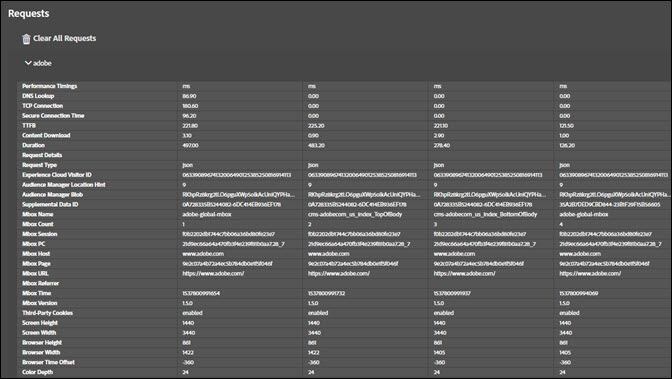
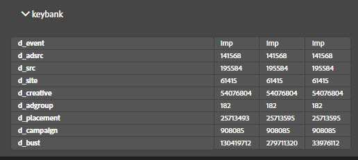

# ソリューションタブ {#solution-tabs}

ソリューションタブをクリックして、特定の Adobe Experience Cloud ソリューションの結果を確認します。

## Analytics {#section-f71dfcc22bb44c86bec328491606a482}

「Analytics」タブは、[Analytics](https://experiencecloud.adobe.com/resources/help/en_US/reference/) 実装に関する情報を提供します。

**ヒット数**

デフォルトでは、同じレポートスイートに対しておこなったすべてのサーバー呼び出しは、折りたたまれます。

**ダウンロード：**&#x200B;表示されたすべてのレポートスイートに関する情報を Excel スプレッドシートとしてダウンロードします。

**すべてのリクエストをクリア：**&#x200B;表示されたすべてのリクエストを Analytics 表示から削除します。リクエストをクリアすると、新しいリクエストが発生したら表示されます。

レポートスイート ID をクリックして、表示を展開します。

この画面には、Debugger が開かれたか、リクエストがクリアされてからのすべてのリクエストが表示されます。デフォルトパラメーターは、わかりやすい名前に自動的にマッピングされます。「Analytics をリンク」機能（後述）を使用して認証する場合、[Prop および eVar](https://experiencecloud.adobe.com/resources/help/en_US/sc/implement/props_eVars.html) 変数は、カスタムのわかりやすい名前（例えば、「prop1」が「ユーザータイプ」として表示される）にマッピングできます。リクエストは、シーケンスに、左から右に表示されます。

**ダウンロード：**&#x200B;レポートスイートに対しておこなわれたすべてのリクエストを Excel スプレッドシートとして保存します。

**リクエストをクリア：**&#x200B;このレポートスイートに対しておこなわれたすべてのリクエストを削除します。新しいリクエストが発生するたびに表示されます。

**リンクされたアカウント（レガシー）**

Click **[!UICONTROL Link Account]**, then enter the requested information to link an Analytics account to the Debugger.

>[!NOTE]
>
>現在、この機能はレガシー Analytics ユーザーログイン資格情報のみサポートしています。

**後処理したヒットを取得**

処理ルールが実行された後に Analytics ヒットに関する値を確認したい場合、「後処理したヒットを取得」オプションを有効にします。この機能を利用するには、Adobe Experience Cloud にサインインする必要があります。

このオプションを有効にすると、Analytics リクエストにデバッグパラメーターが追加されます。ヒットは、他のヒットのように、引き続き処理されます。Debugger は、Analytics デバッグ API を調査して、元のヒット ID を持つヒットの処理ルール後の値を取得します。後処理したヒットは、背景が紫色で、元のヒットの隣に表示されます。

ほとんどの Analytics 実装では、処理ルール後の情報は数分以内に使用できます。Analytics for Target（A4T）実装は、大幅に長くなります。

## Target {#section-988873ba5ede4317953193bd7ac5474c}

「Target」タブを使用して、[Target](https://docs.adobe.com/content/help/en/target/using/target-home.html) リクエストまたは [Mbox Trace](https://docs.adobe.com/content/help/en/target/using/activities/troubleshoot-activities/content-trouble.html) 応答の詳細を表示します。

Click **[!UICONTROL Requests]**, then expand the environment to view information about Target.

をクリック **[!UICONTROL Clear All Requests]** して、現在表示されているリクエストを削除します。 作成したリクエスト量に応じて、より多くのリクエストが表示されます。

また、Target フィルターを使用して、[Target デバッグ目的で Mbox Trace を有効にする](https://docs.adobe.com/content/help/en/target/using/activities/troubleshoot-activities/content-trouble.html)こともできます。

Mbox Trace を有効にするには、開いている Chrome タブで Experience Cloud への認証をおこなう必要があります。有効にすると、Adobe ID ユーザー名が表示されます。ユーザー名を展開して、アクセス権を持つ Experience Cloud 組織に関連付けられた Target クライアントコードを表示します。Mbox Trace を有効にするクライアントコードをクリックして、緑にチェックマークが表示されていることを確認します。Mbox Trace 情報を持つすべての Target リクエストが、クライアントコードでグループ化されて表示されます。Mbox Trace 情報を調査するには、リクエストを展開してタブを確認します。

* [アクティビティ](https://docs.adobe.com/content/help/en/target/using/activities/activities.html) 「アクティビティ」タブには、アクティビティに適合するかどうかにかかわらず、Target リクエスト名に関連付けられたすべてのアクティビティが表示されます。「一致するアクティビティ」は、適合し、そのオファーが応答で配信されたアクティビティです。アクティビティ名を展開して、現在のエクスペリエンスや、そのアクティビティに対してどのオーディエンスおよびターゲット条件が適合するかを確認します。「評価されたアクティビティ」は、適合しているかどうかにかかわらず、評価されたすべてのアクティビティです。「評価済み」だが「一致」しなかったアクティビティに適合しない原因をトラブルシューティングするには、アクティビティ名を展開して、「一致しないオーディエンス」セクションを確認します。

* リクエスト

   [Mbox Trace](https://docs.adobe.com/content/help/en/target/using/activities/troubleshoot-activities/content-trouble.html) のリクエストタブは、メインのリクエストタブに似ています。リクエストヘッダーに加えて、Target リクエストによって渡されたすべてのパラメーターを表示できます。
* プロファイル

   「プロファイルスナップショット」セクションを展開して、訪問者として Target プロファイルデータベースに格納されている[プロファイル情報](https://docs.adobe.com/content/help/en/target/using/audiences/visitor-profiles/variables-profiles-parameters-methods.html)を確認します。すべての in-mbox およびスクリプトプロファイルが、一部のシステムプロファイルと共に、ここに表示されます。ステータス列には、プロファイルシステムを含むリクエストの前後の値と共に、このリクエストの範囲でどのプロファイルが変更したかを表示します。
* Audience Manager

   「Audience Manager」タブの「segmentIds」および「cachedSegmentIds」セクションは、Experience Cloud から Target に共有され、適合した[オーディエンス](https://docs.adobe.com/content/help/en/target/using/audiences/target.html)の ID を表示します。これらは、Audience Manager、Analytics または People コアサービスの Audience Builder で作成されたオーディエンスである可能性があります。これらの ID は、オーディエンス名を見つけるために Audience Manager ユーザーインターフェイスで検索される可能性があります。

以下のビデオは、一般的な Target 機能を示します。

>[!VIDEO](https://video.tv.adobe.com/v/23115t2/?captions=jpn)

以下のビデオは、Mbox Trace を示します。

>[!VIDEO](https://video.tv.adobe.com/v/23113t2/?captions=jpn)

## Audience Manager {#section-1d4484f8b46f457f859ba88039a9a585}

「[Audience Manager](https://experiencecloud.adobe.com/resources/help/en_US/aam/)」タブを使用して、[イベント](https://experiencecloud.adobe.com/resources/help/en_US/aam/dcs-event-calls.html)の詳細を表示します。組織をクリックして展開し、情報を表示します。

をクリック **[!UICONTROL Clear All Events]** して、表示された情報をリセットします。 新しいイベントが発生するたびに表示されます。

**ID 同期**

ID 同期は、受信の非同期データ転送プロセスの最初のステップです。このステップでは、Audience Manager およびベンダーは、各自のサイトベンダーの ID を比較およびマッチングします。

詳しくは、Audience Manager 製品ドキュメントの[受信データ転送のための ID 同期](https://experiencecloud.adobe.com/resources/help/en_US/aam/c_id_sync_in.html)を参照してください。

## Advertising Cloud {#section-ee80a9c509f2462c89c1e5bd8d05d7c8}

「Advertising Cloud」タブを使用して、Advertising Cloud リクエストを表示します。

Click **[!UICONTROL Requests]**, then expand the environment to view information about Advertising Cloud.

をクリック **[!UICONTROL Clear All Requests]** して、現在表示されているリクエストを削除します。 作成したリクエスト量に応じて、より多くのリクエストが表示されます。

## Experience Cloud ID サービス {#section-a96c32f8e63a4991abb296f6e8ea01cf}

「Experience Cloud ID サービス」タブを使用して、[Experience Cloud ID サービス](https://experiencecloud.adobe.com/resources/help/en_US/mcvid/) リクエストを表示します。

Click **[!UICONTROL Requests]**, then expand the environment to view information about Experience Cloud ID Service.

をクリック **[!UICONTROL Clear All Requests]** して、現在表示されているリクエストを削除します。 作成したリクエスト量に応じて、より多くのリクエストが表示されます。
