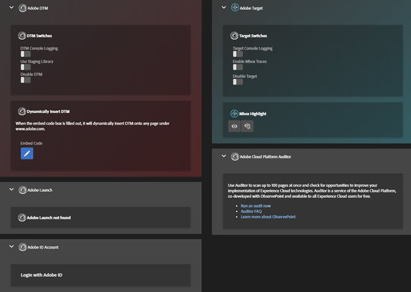

# ツール{#tools}

ツール画面では、インストールしたソリューション用の様々なツールを有効または無効にできます。例えば、Target のコンソールデバッグステートメントをオンにしたり、DTM ステージング用ライブラリを使用したりできます。これらのツールは、Target および DTM がページにインストールされている場合にのみ使用できます。

任意のページで Adobe Experience Platform Launch または DTM を動的に挿入して、Platform Launch または DTM がインストールされていないページをテストできます。**[!UICONTROL Embed Code]** アイコンをクリックして、[埋め込みコード](https://docs.adobe.com/content/help/ja-JP/dtm/using/client-side/deployment.html)を入力し、**[!UICONTROL Save]** をクリックします。

## DTM 情報 {#section-c3d43040440449e5a050170843a600b7}

<table id="table_04625C3319134E169A35DB74C1D1FB31"> 
 <thead> 
  <tr> 
   <th colname="col1" class="entry"> ツール </th> 
   <th colname="col2" class="entry"> 説明 </th> 
  </tr>
 </thead>
 <tbody> 
  <tr> 
   <td colname="col1"> 
 DTM コンソールログ 
 </td> 
   <td colname="col2"> 
このツールは、DTM 特有のデバッグステートメントをブラウザーコンソールに表示します。 
 </td> 
  </tr> 
  <tr> 
   <td colname="col1"> 
ステージング用ライブラリを使用 
 </td> 
   <td colname="col2"> 
このツールは、DTM デバッグ情報にステージング用ライブラリを使用します。 
 </td> 
  </tr> 
  <tr> 
   <td colname="col1"> 
DTM を無効にする 
 </td> 
   <td colname="col2"> 
このツールは、DTM 情報がチェックされるのをブロックします。 
 </td> 
  </tr> 
  <tr> 
   <td colname="col1"> 
 DTM を動的に挿入 
 </td> 
   <td colname="col2"> 
 このツールは、ページに DTM コードを挿入します。埋め込みコードエディターを使用して、挿入されたコードを編集します。 
 </td> 
  </tr> 
 </tbody> 
</table>

## Target 情報 {#section-31090d95f50e455692b672c26e6a2051}

<table id="table_A71D269B49F4417599EBACA44D5CCF4F"> 
 <thead> 
  <tr> 
   <th colname="col1" class="entry"> ツール </th> 
   <th colname="col2" class="entry"> 説明 </th> 
  </tr>
 </thead>
 <tbody> 
  <tr> 
   <td colname="col1"> 
Target コンソール ログ 
 </td> 
   <td colname="col2"> 
このツールは、mboxDebug=true と呼ばれる cookie をブラウザーに追加することで、すべて AT: プレフィックスで始まる、Target 特有のデバッグステートメントをブラウザーコンソールに表示します。この時点では、コンソールステートメントは Debugger ログ画面内に表示されませんが、ブラウザーのネイティブデバッグコンソール.に表示されます。 
 
 このツールには、at.js 0.9.6 以降が必要です。古いバージョンの at.js を使用している場合、コンソールログをオンにするための ?mboxDebug=true クエリ文字列パラメーターを URL に追加できます。mbox.js を使用している場合、?_AT_Debug=console パラメーターを追加して、Visual Experience Composer アクティビティに制限されるコンソールログをオンにできます。 
 </td> 
  </tr> 
  <tr> 
   <td colname="col1"> 
 Mbox Traces を有効にする 
 </td> 
   <td colname="col2"> 
このツールは、詳細情報を Target 応答に追加します。Debugger の Target／Mbox Trace 画面に表示できます。 
 
 このツールを有効にするには、いずれかの Chrome タブでExperience Cloud にログインする必要があります。 
 </td> 
  </tr> 
  <tr> 
   <td colname="col1"> 
Target を無効にする 
 </td> 
   <td colname="col2"> 
このツールは、mboxDisable=true と呼ばれる cookie をブラウザーに追加することで、すべての Target リクエストを無効にします。 
 
 このツールには、at.js 0.9.6 以降が必要です。古いバージョンを使用している場合、mbox を無効にするための ?mboxDisable=trueクエリ文字列パラメーターを URL に追加できます。 
 </td> 
  </tr> 
  <tr> 
   <td colname="col1"> 
 mbox ハイライト 
 </td> 
   <td colname="col2"> 
 このツールは、従来のラップスタイルの mbox の周囲に赤いボックスを描画します。 
 </td> 
  </tr> 
 </tbody> 
</table>

以下のビデオでは、Debugger 拡張機能と Adobe Target の使用方法を説明します。

>[!VIDEO](https://video.tv.adobe.com/v/23115t2/)
