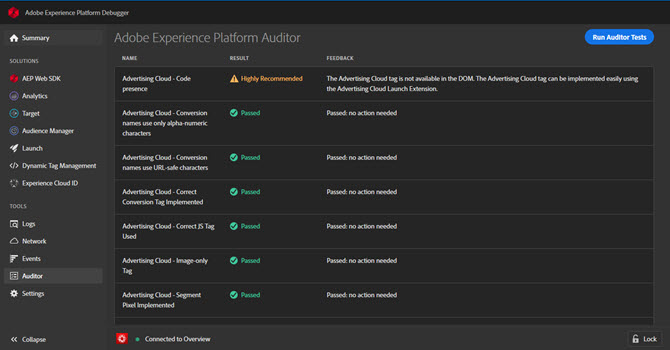

# Auditor {#auditor}

>[!IMPORTANT]
>
>Adobe Experience Platform Debugger は現在ベータ版です。ドキュメントと機能は変更される場合があります。

Adobe Experience Platform [Auditor](https://docs.adobe.com/content/help/ja-JP/auditor/using/overview.html) を使用して、Auditor 画面からページに対して一連の監査を実行できます。

1. 左側のナビゲーションで **[!UICONTROL Auditor]** をクリックします。
1. 「**[!UICONTROL Run Auditor Tests]**」をクリックします。

テスト結果が表示されます。

結果リストには、テストとその結果が表示され、問題を解決するための提案が示されます。