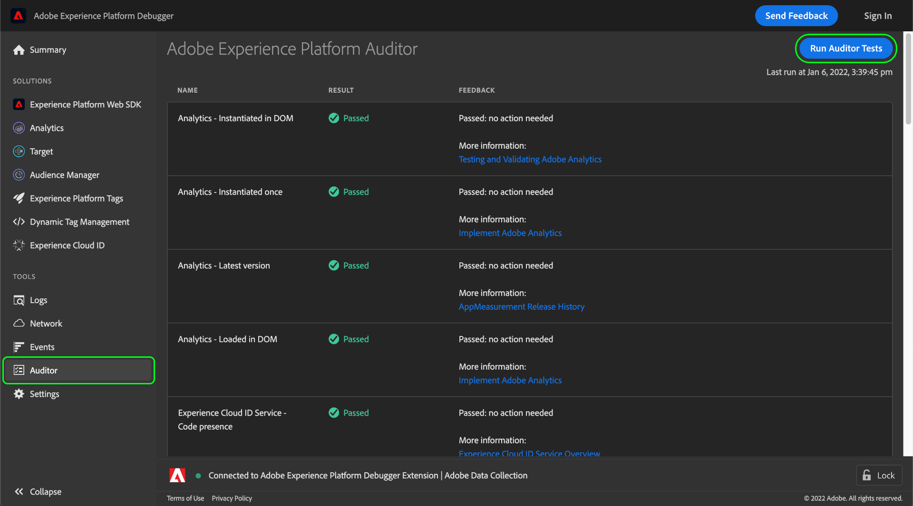

# Auditor

>[!IMPORTANT]
>
>Adobe Experience Platform Debugger は現在ベータ版です。ドキュメントと機能は変更される場合があります。

Adobe Experience Platform Debugger で、 **[!UICONTROL Auditor]** タブを使用して、ページに対して一連の監査テストを実行します。

この機能を使用するには：

1. 選択 **[!UICONTROL Auditor]** をクリックします。
1. **[!UICONTROL Run Auditor Tests]** を選択します。テストが完了すると、その結果は次のように表示されます。

結果リストには、テストとその結果が表示され、問題を解決するための提案が示されます。
