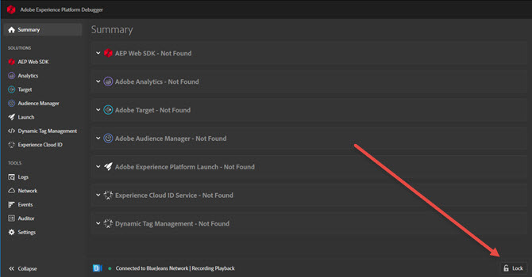

# Debugger の設定

>[!IMPORTANT]
>
>Adobe Experience Cloud Debugger 2.0 は現在ベータ版です。ドキュメントと機能は変更される場合があります。

Debugger の外観と動作に関する特定の要素を設定できます。

## ライトモードとダークモード

Debugger が開いたら、**** に移動して「**ダークモード**」（デフォルト）または「**ライトモード**」を選択することで、好みの外観を選択できます。

## リセット

「**[!UI CONTROL すべてのデータと設定をリセット]**」をクリックして、すべてのデータをクリアし、既定の設定に戻します。

## 1 つのページに Debugger をロックする

サイト上のページを変更すると、Debugger ウィンドウが更新され、そのページの情報が表示されます。接続しているページの名前が画面の下部に表示されます。Debugger を 1 つのページでロックしたままにするには、Debugger ウィンドウの右下隅で **[!UICONTROL Lock]** をクリックします。

これは、ページのデバッグ中に、ドキュメントを読んだり、別のページの情報を表示したりする場合に役立ちます。