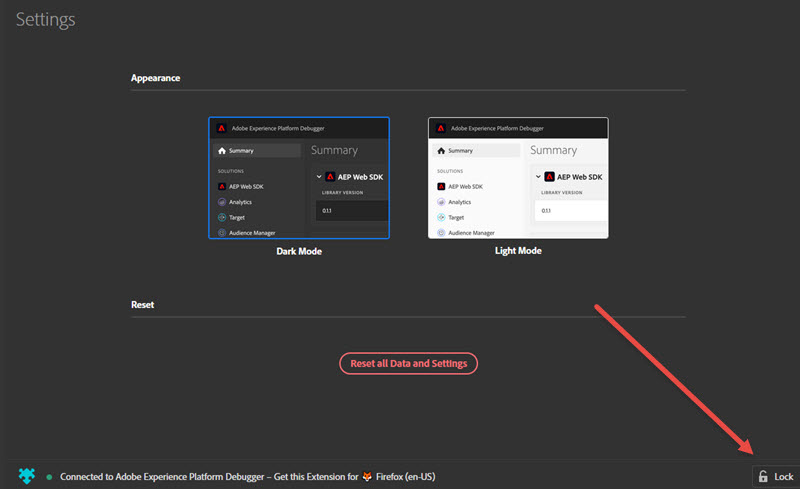

# Debugger の設定

>[!IMPORTANT]
>
>Adobe Experience Platform Debugger は現在ベータ版です。ドキュメントと機能は変更される場合があります。

Experience Platform Debugger の外観と動作に関する特定の要素を設定できます。

## ライトモードとダークモード

Experience Platform Debugger が開いたら、**[!UICONTROL Settings]** に移動して「**ダークモード**」（デフォルト）または「**ライトモード**」を選択することで、好みの外観を選択できます。

## リセット

**[!UICONTROL Reset all Data and Settings]** をクリックしてすべてのデータを消去し、デフォルト設定に戻ります。

## あるページに Experience Platform Debugger をロックする

サイト上のページを変更すると、Experience Platform Debugger ウィンドウが更新され、そのページの情報が表示されます。接続しているページの名前が画面の下部に表示されます。Experience Platform Debugger を 1 つのページでロックしたままにするには、Experience Platform Debugger ウィンドウの右下隅で **[!UICONTROL Lock]** をクリックします。

これは、ページのデバッグ中に、ドキュメントを読んだり、別のページの情報を表示したりする場合に役立ちます。