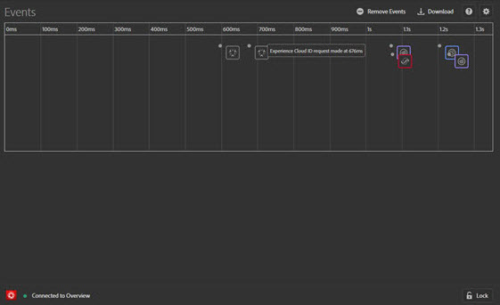

# イベント {#events}

>[!IMPORTANT]
>
>Adobe Experience Cloud Debugger 2.0 は現在ベータ版です。ドキュメントと機能は変更される場合があります。

イベント画面では、発生したイベントのグラフィックがタイムラインに表示されます。

各イベントに対して、該当する Experience Cloud ソリューションのアイコンがタイムラインに表示されます。アイコンは、データレイヤーに対する変更も表示するようになりました（有効になっている場合）。イベントの概要を表示するアイコンの上にマウスポインターを置きます。イベントをクリックして詳細を表示します。複数のイベントを表示するには、Shift キーまたは Control キーを押しながらクリックします。

詳細をクリックして表示します。

## データレイヤーの変更の追跡

タイムラインでデータレイヤーの変更の追跡を有効にするには、次の手順を実行します。

1. 右上の歯車アイコンをクリックします。
1. データレイヤーの名前を入力します。

   

1. 「**[!UICONTROL Save]**」をクリックします。

データレイヤーの変更の詳細には、削除または追加された内容が表示されます。**{}** をクリックすると、データレイヤーの詳細を確認できます。

## イベント情報のダウンロード

**[!UICONTROL Download]** をクリックして、ページ呼び出しに関する情報を示す Excel ファイルをダウンロードします。