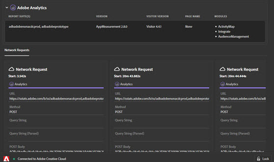

# ネットワーク{#network}

>[!IMPORTANT]
>
>Adobe Experience Platform Debugger は現在ベータ版です。ドキュメントと機能は変更される場合があります。

ネットワーク情報を表示するには、「**[!UICONTROL ネットワーク]**」をクリックします。

ネットワーク画面は、ページでのすべての Adobe Experience Cloud ソリューション呼び出しを集計して、左から右の順に表示します。標準パラメーターは、わかりやすい名前で自動的にラベル付けされ、同じ役割の共通パラメーターにグループ化されて配置されます。

この画面は、複数のヒットをまたいでキーと値のペアを比較する場合に便利です。Experience Cloud 訪問者 ID や追加データ IDなど、統合に使用されたパラメーターが統合内で一貫していることを確認できます。

>[!NOTE]
>
>この時点では、ソリューション呼び出し（例えば、Analytics コンテキスト変数、Target カスタムパラメーター、Experience Cloud ID サービス顧客 ID）に渡されたすべてのパラメーターがネットワーク画面に表示されているわけではありません。

情報をソリューションで変更するには、左側のナビゲーションのリストから表示するソリューションを選択します。次の例は、Analytics のみを表示するようにフィルターされています。

すべてのソリューションの表示に戻るには、**[!UICONTROL をクリックします。ネットワーク]**

ネットワーク表示の項目をクリックすると、展開されて表示されます。展開された表示ウィンドウから、表示された情報をクリップボードにコピーできます。

<!--Use the icon at the top of each column to copy the server call URL to your clipboard, where you can paste it into another document for reference or debugging purposes.

-->

リストを消去するには、「**[!UICONTROL イベントを削除]**」をクリックします。

この画面に関する情報を含むExcelファイルをダウンロードするには、「**[!UICONTROL ダウンロード]**」をクリックします。
