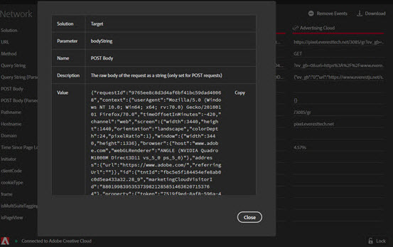

# ネットワーク情報 {#network-information}

To view Network information, click **[!UICONTROL Network]**.

ネットワーク画面は、ページでのすべての Adobe Experience Cloud ソリューション呼び出しを集計して、左から右の順に表示します。.標準パラメーターは、わかりやすい名前で自動的にラベル付けされ、同じ役割の共通パラメーターにグループ化されて配置されます。

この画面は、Experience cloud訪問者IDや追加のデータIDなどの統合に使用するパラメーターが、統合間で一致していることを確認するのに役立ちます。

>[!NOTE]
>
>この時点では、ソリューション呼び出し（例えば、Analytics コンテキスト変数、Target カスタムパラメーター、Experience Cloud ID サービス顧客 ID）に渡されたすべてのパラメーターがネットワーク画面に表示されているわけではありません。

情報をソリューションでフィルターするには、左側のナビゲーションのリストから表示するソリューションを選択します。 次の例は、Analyticsのみを表示するようにフィルターされています。

すべてのソリューションの表示に戻るには、 **[!UICONTROL Network]**

展開されたビューを表示するには、[ネットワーク]ビューの項目をクリックします。 展開された表示ウィンドウから、表示された情報をクリップボードにコピーできます。

<!--Use the icon at the top of each column to copy the server call URL to your clipboard, where you can paste it into another document for reference or debugging purposes.

-->

リストをクリアするには、をクリックしま **[!UICONTROL Remove Events]**&#x200B;す。

この画面に情報を含むExcelファイルをダウンロードするには、をクリックしま **[!UICONTROL Download]**&#x200B;す。