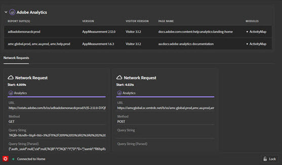

# 解決策{#solution-tabs}

ソリューションをクリックして、特定のAdobe Experience cloudソリューションの結果を表示します。

## AEP Web SDK {#aep}

AEP Web SDK画面には、Adobe Experience Platform Web SDKに関する情報が表示されます。 をクリック **[!UICONTROL Configure]** して、コンソールログのオン/オフを切り替えます。

## Analytics {#section-f71dfcc22bb44c86bec328491606a482}

The Analytics screen provides information about your [Analytics](https://docs.adobe.com/content/help/en/analytics/landing/home.html) implementation.

## Target {#section-988873ba5ede4317953193bd7ac5474c}

Use the Target screen to view [Target](https://docs.adobe.com/content/help/en/target/using/target-home.html) requests or [Mbox Trace](https://docs.adobe.com/content/help/en/target/using/activities/troubleshoot-activities/content-trouble.html) response details.

## Audience Manager {#section-1d4484f8b46f457f859ba88039a9a585}

「[Audience Manager](https://docs.adobe.com/content/help/en/audience-manager/user-guide/aam-home.html)」タブを使用して、[イベント](https://docs.adobe.com/content/help/en/audience-manager/user-guide/api-and-sdk-code/dcs/dcs-event-calls/dcs-event-calls.html)の詳細を表示します。組織をクリックして展開し、情報を表示します。

## Launch {#section-ee80a9c509f2462c89c1e5bd8d05d7c8}

「起動」セクションを使用して、起動リクエストを表示します。 をクリックして埋め込みコ **[!UICONTROL Configuration]** ードを設定す [ることもできます](https://docs.adobe.com/content/help/en/launch/using/reference/upgrade/link-dtm-embed-code.html)。 デバッガー内で埋め込みコードを編集、置換、または追加できます。

## Dynamic Tag Management {#dynamic-tag-management}

「Dynamic Tag Management」セクションを使用して、DTMリクエストを表示します。 をクリックして埋め込みコ **[!UICONTROL Configuration]** ードを設定す [ることもできます](https://docs.adobe.com/content/help/en/dtm/using/client-side/code.html)。

## Experience Cloud ID サービス {#section-a96c32f8e63a4991abb296f6e8ea01cf}

「Experience Cloud ID サービス」タブを使用して、[Experience Cloud ID サービス](https://docs.adobe.com/content/help/en/id-service/using/home.html) リクエストを表示します。