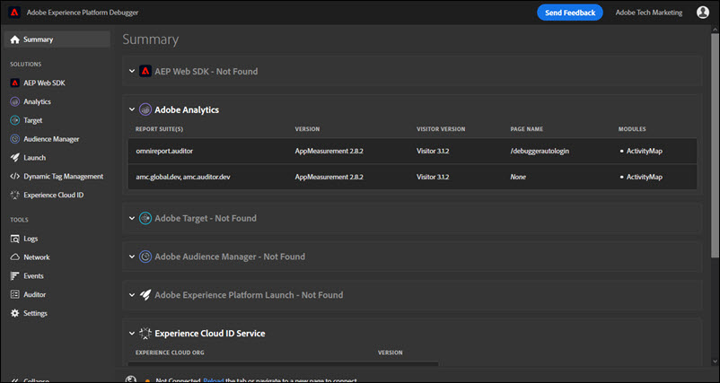

# 概要画面 {#summary-screen}

>[!IMPORTANT]
>
>Adobe Experience Platform Debugger は現在ベータ版です。ドキュメントと機能は変更される場合があります。

Adobe Experience Platform Debugger を実行するには、ブラウザーバーのアイコンをクリックし、ブラウザーで確認するページを開きます。

Adobe Experience Platform Debugger サマリ画面が表示されます。

この画面には、各 Adobe Experience Cloud ソリューションに関する情報が表示されます。表示される情報はソリューションによって異なりますが、通常、ソリューションライブラリおよびバージョン（例：「AppMeasurement v2.9」）およびアカウント識別子（Analytics レポートスイート ID、Target クライアントコード、Audience Manager パートナー ID など）の情報が含まれます。

## Experience Platform Debugger に表示される情報

Experience Platform Debugger には、各ソリューションについて以下の情報が表示されます。

**Adobe Analytics**

<table id="table_BEB9CC58E59D4D86BC895A8A51D84A2C"> 
 <tbody> 
  <tr> 
   <td colname="col1"> 
レポートスイート 
 </td> 
   <td colname="col2"> 
<a href="https://experiencecloud.adobe.com/resources/help/ja_JP/reference/report_suites_admin.html" format="html" scope="external">レポートスイート</a>は、選択した Web サイト、Web サイト群または Web ページのサブセットに関する完全な独立レポートを定義します。 
 </td> 
  </tr> 
  <tr> 
   <td colname="col1"> 
バージョン 
 </td> 
   <td colname="col2"> 
ページ用に定義された <a href="https://docs.adobe.com/content/help/ja-JP/analytics/implementation/js/migrate-from-hcode.html" format="html" scope="external"> AppMeasurement</a> バージョン。 
 </td> 
  </tr> 
  <tr> 
   <td colname="col1"> 
訪問者のバージョン 
 </td> 
   <td colname="col2"> 
<a href="https://experiencecloud.adobe.com/resources/help/ja_JP/sc/implement/visid_analytics.html" format="html" scope="external">訪問者 ID</a> ライブラリ.のバージョン。 
 </td> 
  </tr> 
  <tr> 
   <td colname="col1"> 
ページ名 
 </td> 
   <td colname="col2"> 
サイトのわかりやすい名前を含む Analytics に送信された <a href="https://experiencecloud.adobe.com/resources/help/ja_JP/sc/implement/pageName.html" format="html" scope="external">pageName</a> 変数。 
 </td> 
  </tr> 
  <tr> 
   <td colname="col1"> 
モジュール 
 </td> 
   <td colname="col2"> 
Adobe Analytics によって読み込まれたモジュール。 
 </td> 
  </tr> 
 </tbody> 
</table>

**Audience Manager**

<table id="table_784AEABADBDA4D14BB9A7A9CB9EF07C3"> 
 <tbody> 
  <tr> 
   <td colname="col1"> 
パートナー 
 </td> 
   <td colname="col2"> 
DIL インスタンスの<a href="https://experiencecloud.adobe.com/resources/help/ja_JP/aam/r_dil_get_partner.html" format="html" scope="external">パートナー名</a>。 
 </td> 
  </tr> 
  <tr> 
   <td colname="col1"> 
バージョン 
 </td> 
   <td colname="col2"> 
DIL インスタンスの<a href="https://experiencecloud.adobe.com/resources/help/ja_JP/aam/r_api_return_versions_dil.html" format="html" scope="external">バージョン番号</a>。 
 </td> 
  </tr> 
  <tr> 
   <td colname="col1"> 
UUID 
 </td> 
   <td colname="col2"> 
DIL インスタンスに関連付けられた<a href="https://experiencecloud.adobe.com/resources/help/ja_JP/aam/ids-in-aam.html" format="html" scope="external">一意のユーザー ID</a>。 
 </td> 
  </tr> 
 </tbody> 
</table>

**Adobe Experience Platform Launch**

<table id="table_E9574975444A407887E26514D1BB1601"> 
 <tbody> 
  <tr> 
   <td colname="col1"> 
名前 
 </td> 
   <td colname="col2"> 
Platform Launch <a href="https://docs.adobe.com/content/help/ja-JP/launch/using/reference/admin/companies-and-properties.html" format="https" scope="external">プロパティ</a>の名前 
 </td> 
  </tr> 
  <tr> 
   <td colname="col1"> 
バージョン 
 </td> 
   <td colname="col2"> 
Turbine のバージョン。</a> 
 </td> 
  </tr> 
  <tr> 
   <td colname="col1"> 
ビルド日 
 </td> 
   <td colname="col2"> 
Platform Launch <a href="https://docs.adobe.com/content/help/ja-JP/launch/using/reference/publish/libraries.html" format="https" scope="external">ライブラリ</a>のビルド日 
 </td> 
  </tr> 
  <tr> 
   <td colname="col1"> 
環境 
 </td> 
   <td colname="col2"> 
Platform Launch ライブラリによって使用される<a href="https://docs.adobe.com/content/help/ja-JP/launch/using/reference/publish/environments.html" format="https" scope="external">環境</a> 
 </td> 
  </tr> 
  <tr> 
   <td colname="col1"> 
拡張機能 
 </td> 
   <td colname="col2"> 
ページで使用される拡張機能。 
 </td> 
  </tr> 
 </tbody> 
</table>

**Adobe Experience Platform Web SDK**

<table id="table_DC76D63FA6EF4891906B9E1D3E4A8A6C"> 
 <tbody> 
  <tr> 
   <td colname="col1"> 
ライブラリバージョン 
 </td> 
   <td colname="col2"> 
Adobe Experience Platform Web SDK <a href="https://docs.adobe.com/content/help/ja-JP/launch/using/extensions-ref/adobe-extension/aep-extension/overview.html" format="html" scope="external">ライブラリのバージョン番号</a> 
 </td> 
  </tr> 
  <tr> 
   <td colname="col1"> 
名前空間
 </td> 
   <td colname="col2"> 
拡張機能で識別される名前。
 </td> 
  </tr> 
  <tr> 
   <td colname="col1"> 
プロパティ ID 
 </td> 
   <td colname="col2"> 
拡張機能で指定された Platform Launch プロパティの名前 
 </td> 
  </tr> 
  <tr> 
   <td colname="col1"> 
エッジドメイン 
 </td> 
   <td colname="col2"> 
ドメインは、Adobe Experience Platform 拡張機能がデータの送受信をおこなうドメインです。 
 </td> 
  </tr> 
  <tr> 
   <td colname="col1"> 
IMS 組織 ID 
 </td> 
   <td colname="col2"> 
拡張機能で指定された、アドビで送信するデータの送信先となる組織。 
 </td> 
  </tr> 
  <tr> 
   <td colname="col1"> 
ログ有効 
 </td> 
   <td colname="col2"> 
このプロパティのログが有効かどうかを指定します。
 </td> 
  </tr> 
 </tbody> 
</table>

**Adobe Experience Cloud ID サービス**

<table id="table_274CFCEFA8F34D16BB546B4669EC0209"> 
 <tbody> 
  <tr> 
   <td colname="col1"> 
Experience Cloud 組織 ID 
 </td> 
   <td colname="col2"> 
<a href="https://experiencecloud.adobe.com/resources/help/ja_JP/mcvid/" format="https" scope="external"> 組織 ID</a>。 
 </td> 
  </tr> 
  <tr> 
   <td colname="col1"> 
バージョン 
 </td> 
   <td colname="col2"> 
<a href="https://experiencecloud.adobe.com/resources/help/ja_JP/sc/implement/visid_analytics.html" format="html" scope="external">訪問者 ID</a> ライブラリのバージョン。 
 </td> 
  </tr> 
 </tbody> 
</table>

**Adobe Target**

<table id="table_D30E0CD20FB04E41862B22655136E043"> 
 <tbody> 
  <tr> 
   <td colname="col1"> 
クライアントコード 
 </td> 
   <td colname="col2"> 
Target <a href="https://docs.adobe.com/content/help/ja-JP/target/using/implement-target/client-side/deploy-at-js/implementing-target-without-a-tag-manager.html" format="html" scope="external"> クライアントコード</a>。 
 </td> 
  </tr> 
  <tr> 
   <td colname="col1"> 
バージョン 
 </td> 
   <td colname="col2"> 
現在の <a href="https://docs.adobe.com/content/help/ja-JP/target/using/implement-target/client-side/target-atjs-versions.html" format="html" scope="external"> at.js</a> または mbox.js バージョン。 
 </td> 
  </tr> 
  <tr> 
   <td colname="col1"> 
グローバルリクエスト名 
 </td> 
   <td colname="col2"> 
Target 実装の各 Web ページの最上部でおこなわれる単一のサーバー呼び出しを参照する <a href="https://docs.adobe.com/help/ja-JP/target/using/implement-target/client-side/mbox-implement/global-mbox/understanding-global-mbox.html" format="html" scope="external">global mbox</a>。 
 </td> 
  </tr> 
  <tr> 
   <td colname="col1"> 
ページ読み込みイベント 
 </td> 
   <td colname="col2"> 
ページの読み込み時に実行される<a href="https://docs.adobe.com/content/help/ja-JP/launch/using/extensions-ref/adobe-extension/target-extension/overview.html" format="html" scope="external">イベント</a>のタイプ。 
 </td> 
  </tr> 
  <tr> 
   <td colname="col1"> 
リクエスト名 
 </td> 
   <td colname="col2"> 
ページ上の <a href="https://docs.adobe.com/content/help/ja-JP/target/using/implement-target/client-side/mbox-implement/global-mbox/understanding-global-mbox.html" format="html" scope="external"> 場所</a>の周囲にある mbox の名前。コードまたはタグマネージャーで Debugging イベントリスナーを実装し、Target UI で必要な<a href="https://docs.adobe.com/content/help/ja-JP/target/using/administer/response-tokens.html" format="html" scope="external">レスポンストークン</a>をオンにする場合にのみ、認証なしで使用できます。 
 </td> 
  </tr> 
  <tr> 
   <td colname="col1"> 
アクティビティ名 
 </td> 
   <td colname="col2"> 
Target <a href="https://docs.adobe.com/content/help/ja-JP/target/using/activities/activities.html" format="html" scope="external"> キャンペーンまたはアクティビティ</a>の名前。コードまたはタグマネージャーで Debugging イベントリスナーを実装し、Target UI で必要な<a href="https://docs.adobe.com/content/help/ja-JP/target/using/administer/response-tokens.html" format="html" scope="external">レスポンストークン</a>をオンにする場合にのみ、認証なしで使用できます。 
 </td> 
  </tr> 
  <tr> 
   <td colname="col1"> 
アクティビティ ID 
 </td> 
   <td colname="col2"> 
Target アクティビティの ID。コードまたはタグマネージャーで Debugging イベントリスナーを実装し、Target UI で必要な<a href="https://docs.adobe.com/content/help/ja-JP/target/using/administer/response-tokens.html" format="html" scope="external">レスポンストークン</a>をオンにする場合にのみ、認証なしで使用できます。 
 </td> 
  </tr> 
  <tr> 
   <td colname="col1"> 
エクスペリエンス名 
 </td> 
   <td colname="col2"> 
Target <a href="https://docs.adobe.com/content/help/ja-JP/target/using/experiences/experiences.html" format="html" scope="external"> エクスペリエンス</a>の名前。コードまたはタグマネージャーで Debugging イベントリスナーを実装し、Target UI で必要な<a href="https://docs.adobe.com/content/help/ja-JP/target/using/administer/response-tokens.html" format="html" scope="external">レスポンストークン</a>をオンにする場合にのみ、認証なしで使用できます。 
 </td> 
  </tr> 
  <tr> 
   <td colname="col1"> 
エクスペリエンス ID 
 </td> 
   <td colname="col2"> 
Target エクスペリエンスの ID。コードまたはタグマネージャーで Debugging イベントリスナーを実装し、Target UI で必要な<a href="https://docs.adobe.com/content/help/ja-JP/target/using/administer/response-tokens.html" format="html" scope="external">レスポンストークン</a>をオンにする場合にのみ、認証なしで使用できます。 
 </td> 
  </tr> 
  <tr> 
   <td colname="col1"> 
オファー     名前
 </td> 
   <td colname="col2"> 
Target <a href="https://docs.adobe.com/content/help/ja-JP/target/using/experiences/offers/manage-content.html" format="html" scope="external"> オファー</a>の名前。コードまたはタグマネージャーで Debugging イベントリスナーを実装し、Target UI で必要な<a href="https://docs.adobe.com/content/help/ja-JP/target/using/administer/response-tokens.html" format="html" scope="external">レスポンストークン</a>をオンにする場合にのみ、認証なしで使用できます。 
 </td> 
  </tr> 
  <tr> 
   <td colname="col1"> 
オファー ID 
 </td> 
   <td colname="col2"> 
Target オファーの ID。コードまたはタグマネージャーで Debugging イベントリスナーを実装し、Target UI で必要な<a href="https://docs.adobe.com/content/help/ja-JP/target/using/administer/response-tokens.html" format="html" scope="external">レスポンストークン</a>をオンにする場合にのみ、認証なしで使用できます。 
 </td> 
  </tr> 
 </tbody> 
</table>

