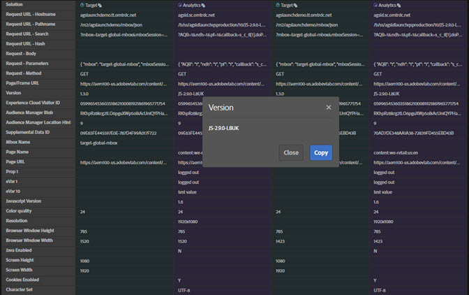

# ネットワーク情報{#network-information}

ネットワーク情報を表示するには、をクリックしま **[!UICONTROL Network]**&#x200B;す。

ネットワーク画面では、ページ上で行われたすべてのAdobe Experience cloudソリューション呼び出しが集約され、左から右に順に表示されます。 標準パラメータは、わかりやすい名前で自動的にラベル付けされ、同じ役割の共通パラメータをグループ化するように配置されます。

>[!TIP]
>
>この画面は、Experience cloud訪問者IDや追加のデータIDなどの統合に使用されるパラメーターが、統合間で一致していることを確認するのに役立ちます。

>[!NOTE]
>
>現時点では、ソリューション呼び出しで渡されるすべてのパラメーター（例えば、Analyticsコンテキスト変数、Targetカスタムパラメーター、Experience Cloud IDサービス顧客ID）がネットワーク画面に表示されるわけではありません。

すべての情報を表示するには、を選択しま **[!UICONTROL All]**&#x200B;す。

また、情報をソリューションでフィルタリングすることもできます。 表示するソリューションを選択します。 複数のソリューションを同時に表示できます。 選択したソリューションフィルターがハイライト表示されます。

[ネットワーク]ビューの項目をクリックすると、その項目が大きく表示されます。 展開されたビューウィンドウから、表示された情報をクリップボードにコピーできます。

各列の上部にあるアイコンを使用して、サーバーコールのURLをクリップボードにコピーし、参照やデバッグのために別のドキュメントに貼り付けます。

