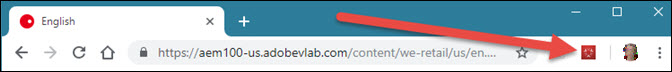
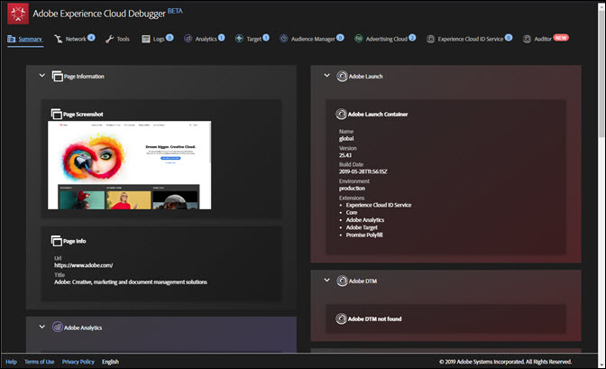

# 概要画面{#summary-screen}

Experience cloudデバッガーを実行するには、拡張機能バーの拡張機能アイコンをクリックし、Chromeで確認するページを開きます。

Adobe Experience cloudデバッガーの概要画面が表示されます。

この画面には、ページのサムネールと、ページのURLおよびタイトルが表示されます。 また、各Adobe Experience cloudソリューションに関する情報も表示されます。 表示される情報はソリューションによって異なりますが、通常、ソリューションライブラリとバージョン（「AppMeasurement v2.9」など）、アカウント識別子（AnalyticsレポートスイートID、Targetクライアントコード、Audience ManagerパートナーIDなど）などの情報が含まれます。

ウィンドウ上部のタブの横に表示される青色の数字は、行われたサーバーコールの数を示します。 これらをゼロにリセットするには、各タブ内 **[!UICONTROL Clear All Requests]** をクリックします。

例えば、次の図はAdobe targetに関する情報を示しています。 以下に示すアクティビティの詳細を認証なしで公開するには、コードマネージャーまたはタグマネージャーにデバッグイベントリスナーを実装し、Target UIで必要な応答トークンを [有効にする](https://docs.adobe.com/content/help/en/target/using/administer/response-tokens.html) 必要があります。

## Auditorでの監査の実行 {#section-82bc57440406461ebf27a16855b71655}

Adobe Auditorを使用して、ページに対して一連の監査を実行できます。 Auditorを実行するには、上部のメニ **[!UICONTROL Auditor]** ューでをクリックし、をクリックしま **[!UICONTROL Audit Page Now]**&#x200B;す。 Adobe Auditorを開くには、をクリックしま **[!UICONTROL Run Multi-Page Audit Now]**&#x200B;す。

## デバッガーに表示される情報 {#section-88a95ba53dca43d9b96a585e75e5f5cf}

デバッガーには、各ソリューションに関する次の情報が表示されます。

**ページ情報**

<table id="table_FF3B9083524244D29AF350978A0AC236"> 
 <tbody> 
  <tr> 
   <td colname="col1"> 
ページのスクリーンショット 
 </td> 
   <td colname="col2"> 
ページのサムネール 
 </td> 
  </tr> 
  <tr> 
   <td colname="col1"> 
URL 
 </td> 
   <td colname="col2"> 
ページのURL 
 </td> 
  </tr> 
  <tr> 
   <td colname="col1"> 
Title 
 </td> 
   <td colname="col2"> 
&lt;TITLE&gt;タグで指  定した名前 
 </td> 
  </tr> 
 </tbody> 
</table>

**Adobe Analytics**

<table id="table_BEB9CC58E59D4D86BC895A8A51D84A2C"> 
 <tbody> 
  <tr> 
   <td colname="col1"> 
レポートスイート 
 </td> 
   <td colname="col2"> 
A <a href="https://experiencecloud.adobe.com/resources/help/en_US/reference/report_suites_admin.html" format="html" scope="external"> report suite</a> defines the complete, independent reporting on a chosen website, set of websites, or subset of web pages 
 </td> 
  </tr> 
  <tr> 
   <td colname="col1"> 
バージョン 
 </td> 
   <td colname="col2"> 
ページに <a href="https://experiencecloud.adobe.com/resources/help/en_US/sc/implement/appmeasure_mjs.html" format="html" scope="external"> 対して定義されているAppMeasurement</a> バージョン 
 </td> 
  </tr> 
  <tr> 
   <td colname="col1"> 
訪問者のバージョン 
 </td> 
   <td colname="col2"> 
訪問者IDライブラリ <a href="https://experiencecloud.adobe.com/resources/help/en_US/sc/implement/visid_analytics.html" format="html" scope="external"> のバージョン</a> 。 
 </td> 
  </tr> 
  <tr> 
   <td colname="col1"> 
ページ名 
 </td> 
   <td colname="col2"> 
Analyticsに送 <a href="https://experiencecloud.adobe.com/resources/help/en_US/sc/implement/pageName.html" format="html" scope="external"> 信され</a> 、サイトのわかりやすい名前を含むpageName変数。 
 </td> 
  </tr> 
  <tr> 
   <td colname="col1"> 
モジュール 
 </td> 
   <td colname="col2"> 
Adobe Analyticsによって読み込まれるモジュール 
 </td> 
  </tr> 
 </tbody> 
</table>

**Audience Manager**

<table id="table_784AEABADBDA4D14BB9A7A9CB9EF07C3"> 
 <tbody> 
  <tr> 
   <td colname="col1"> 
パートナー 
 </td> 
   <td colname="col2"> 
DILイン <a href="https://experiencecloud.adobe.com/resources/help/en_US/aam/r_dil_get_partner.html" format="html" scope="external"> スタンスの</a> 、パートナー名 
 </td> 
  </tr> 
  <tr> 
   <td colname="col1"> 
バージョン 
 </td> 
   <td colname="col2"> 
DILインスタンス<a href="https://experiencecloud.adobe.com/resources/help/en_US/aam/r_api_return_versions_dil.html" format="html" scope="external"> のバージョン</a> 番号です。 
 </td> 
  </tr> 
  <tr> 
   <td colname="col1"> 
UUID 
 </td> 
   <td colname="col2"> 
DILイン <a href="https://experiencecloud.adobe.com/resources/help/en_US/aam/ids-in-aam.html" format="html" scope="external"> スタンスに関連付けられ</a> 、一意のユーザーID 
 </td> 
  </tr> 
 </tbody> 
</table>

**Adobe Launch**

<table id="table_E9574975444A407887E26514D1BB1601"> 
 <tbody> 
  <tr> 
   <td colname="col1"> 
名前 
 </td> 
   <td colname="col2"> 
Adobe Launchプロパティの名 <a href="https://docs.adobelaunch.com/administration/companies-and-properties" format="https" scope="external"> 前</a> 
 </td> 
  </tr> 
  <tr> 
   <td colname="col1"> 
バージョン 
 </td> 
   <td colname="col2"> 
タービンのバージ <a href="https://developer.adobelaunch.com/guides/extensions/turbine-free-variable/" format="https" scope="external"> ョン</a> 
 </td> 
  </tr> 
  <tr> 
   <td colname="col1"> 
ビルド日 
 </td> 
   <td colname="col2"> 
Launch <a href="https://docs.adobelaunch.com/publishing/libraries" format="https" scope="external"> library</a> build date 
 </td> 
  </tr> 
  <tr> 
   <td colname="col1"> 
環境 
 </td> 
   <td colname="col2"> 
起動ラ <a href="https://docs.adobelaunch.com/administration/environments" format="https" scope="external"> イブラリ</a> で使用される環境 
 </td> 
  </tr> 
  <tr> 
   <td colname="col1"> 
スクリプトディレクトリ 
 </td> 
   <td colname="col2"> 
起動スクリプトが保存されるディレクトリ 
 </td> 
  </tr> 
 </tbody> 
</table>

**Adobe DTM**

<table id="table_DC76D63FA6EF4891906B9E1D3E4A8A6C"> 
 <tbody> 
  <tr> 
   <td colname="col1"> 
ライブラリ名 
 </td> 
   <td colname="col2"> 
Adobe DTMライブラリの名前<a href="https://experiencecloud.adobe.com/resources/help/en_US/dtm/library_management.html" format="html" scope="external"> 。</a> 
 </td> 
  </tr> 
  <tr> 
   <td colname="col1"> 
バージョン 
 </td> 
   <td colname="col2"> 
タービンのバージョン 
 </td> 
  </tr> 
  <tr> 
   <td colname="col1"> 
ビルド日 
 </td> 
   <td colname="col2"> 
Launch <a href="https://experiencecloud.adobe.com/resources/help/en_US/dtm/library_management.html" format="html" scope="external"> library</a> build date 
 </td> 
  </tr> 
  <tr> 
   <td colname="col1"> 
環境 
 </td> 
   <td colname="col2"> 
DTMライブラリで使用される環境 
 </td> 
  </tr> 
  <tr> 
   <td colname="col1"> 
スクリプトディレクトリ 
 </td> 
   <td colname="col2"> 
DTMスクリプトが保存されるディレクトリ 
 </td> 
  </tr> 
 </tbody> 
</table>

**Adobe Experience Cloud ID サービス**

<table id="table_274CFCEFA8F34D16BB546B4669EC0209"> 
 <tbody> 
  <tr> 
   <td colname="col1"> 
Experience cloud組織ID 
 </td> 
   <td colname="col2"> 
Your <a href="https://experiencecloud.adobe.com/resources/help/en_US/mcvid/" format="https" scope="external"> Organization ID</a> 
 </td> 
  </tr> 
  <tr> 
   <td colname="col1"> 
バージョン 
 </td> 
   <td colname="col2"> 
訪問者IDライブラリのバージョン<a href="https://experiencecloud.adobe.com/resources/help/en_US/sc/implement/visid_analytics.html" format="html" scope="external"> (The version</a> of the visitor ID library) 
 </td> 
  </tr> 
 </tbody> 
</table>

**Adobe Target**

<table id="table_D30E0CD20FB04E41862B22655136E043"> 
 <tbody> 
  <tr> 
   <td colname="col1"> 
Client Code 
 </td> 
   <td colname="col2"> 
Your Target <a href="https://docs.adobe.com/content/help/en/target/using/implement-target/client-side/deploy-at-js/implementing-target-without-a-tag-manager.html" format="html" scope="external"> Client Code </a> 
 </td> 
  </tr> 
  <tr> 
   <td colname="col1"> 
バージョン 
 </td> 
   <td colname="col2"> 
現在の <a href="https://docs.adobe.com/content/help/en/target/using/implement-target/client-side/target-atjs-versions.html" format="html" scope="external"> at.js</a> またはmbox.jsバージョン 
 </td> 
  </tr> 
  <tr> 
   <td colname="col1"> 
Global Mbox Name 
 </td> 
   <td colname="col2"> 
グローバル<a href="https://docs.adobe.com/help/en/target/using/implement-target/client-side/mbox-implement/global-mbox/understanding-global-mbox.html" format="html" scope="external"> mboxは</a> 、Target実装の各Webページの最上部で行われる単一のサーバー呼び出しを指します 
 </td> 
  </tr> 
  <tr> 
   <td colname="col1"> 
mbox 名 
 </td> 
   <td colname="col2"> 
ページ上の場所の周囲のmbox <a href="https://docs.adobe.com/content/help/en/target/using/implement-target/client-side/mbox-implement/global-mbox/understanding-global-mbox.html" format="html" scope="external"> の</a> 名前。 コードまたはタグマネージャーにデバッグイベントリスナーを実装し、Target UIで必要な応答トークンを有効にした場合にの <a href="https://docs.adobe.com/content/help/en/target/using/administer/response-tokens.html" format="html" scope="external"> み</a> 、認証なしで使用できます。 
 </td> 
  </tr> 
  <tr> 
   <td colname="col1"> 
アクティビティ名 
 </td> 
   <td colname="col2"> 
Targetのキャンペーンまたはア <a href="https://docs.adobe.com/content/help/en/target/using/activities/activities.html" format="html" scope="external"> クティビティの名前</a>。 コードまたはタグマネージャーにデバッグイベントリスナーを実装し、Target UIで必要な応答トークンを有効にした場合にの <a href="https://docs.adobe.com/content/help/en/target/using/administer/response-tokens.html" format="html" scope="external"> み</a> 、認証なしで使用できます。 
 </td> 
  </tr> 
  <tr> 
   <td colname="col1"> 
アクティビティID 
 </td> 
   <td colname="col2"> 
TargetアクティビティのID。 コードまたはタグマネージャーにデバッグイベントリスナーを実装し、Target UIで必要な応答トークンを有効にした場合にの <a href="https://docs.adobe.com/content/help/en/target/using/administer/response-tokens.html" format="html" scope="external"> み</a> 、認証なしで使用できます。 
 </td> 
  </tr> 
  <tr> 
   <td colname="col1"> 
レシピ名 
 </td> 
   <td colname="col2"> 
Targetエクスペリエンスの <a href="https://docs.adobe.com/content/help/en/target/using/experiences/experiences.html" format="html" scope="external"> 名前</a>。 コードまたはタグマネージャーにデバッグイベントリスナーを実装し、Target UIで必要な応答トークンを有効にした場合にの <a href="https://docs.adobe.com/content/help/en/target/using/administer/response-tokens.html" format="html" scope="external"> み</a> 、認証なしで使用できます。 
 </td> 
  </tr> 
  <tr> 
   <td colname="col1"> 
レシピ ID 
 </td> 
   <td colname="col2"> 
TargetレシピのID。 コードまたはタグマネージャーにデバッグイベントリスナーを実装し、Target UIで必要な応答トークンを有効にした場合にの <a href="https://docs.adobe.com/content/help/en/target/using/administer/response-tokens.html" format="html" scope="external"> み</a> 、認証なしで使用できます。 
 </td> 
  </tr> 
  <tr> 
   <td colname="col1"> 
オファー 
 </td> 
   <td colname="col2"> 
Targetオファーの名 <a href="https://docs.adobe.com/content/help/en/target/using/experiences/offers/manage-content.html" format="html" scope="external"> 前</a>。 コードまたはタグマネージャーにデバッグイベントリスナーを実装し、Target UIで必要な応答トークンを有効にした場合にの <a href="https://docs.adobe.com/content/help/en/target/using/administer/response-tokens.html" format="html" scope="external"> み</a> 、認証なしで使用できます。 
 </td> 
  </tr> 
  <tr> 
   <td colname="col1"> 
オファー ID 
 </td> 
   <td colname="col2"> 
TargetオファーのID。 コードまたはタグマネージャーにデバッグイベントリスナーを実装し、Target UIで必要な応答トークンを有効にした場合にの <a href="https://docs.adobe.com/content/help/en/target/using/administer/response-tokens.html" format="html" scope="external"> み</a> 、認証なしで使用できます。 
 </td> 
  </tr> 
 </tbody> 
</table>

