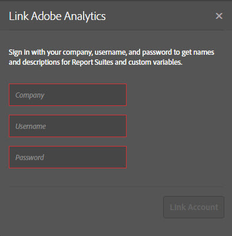
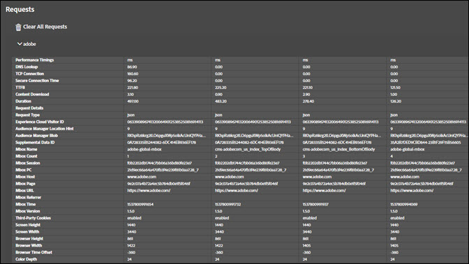

# ソリューションタブ{#solution-tabs}

特定のAdobe Experience cloudソリューションの結果を表示するには、「ソリューション」タブをクリックします。

## Analytics {#section-f71dfcc22bb44c86bec328491606a482}

「解析」タブには、 [Analyticsの実装に関する情報が表示されます](https://experiencecloud.adobe.com/resources/help/en_US/reference/) 。

**ヒット数**

デフォルトでは、同じレポートスイートに対するすべてのサーバー呼び出しが折りたたまれます。

**** ダウンロード：表示されたすべてのレポートスイートに関する情報をExcelスプレッドシートとしてダウンロードします。

**** すべてのリクエストをクリア：Analyticsビューから表示されているすべてのリクエストを削除します。 リクエストを消去すると、新しいリクエストが発生したときに表示されます。

レポートスイートIDをクリックしてビューを展開します。

この画面には、デバッガが開かれたか、リクエストがクリアされた後のすべてのリクエストが表示されます。 デフォルトのパラメーターは、フレンドリ名に自動的にマッピングされます。 [「リンク分析](https://experiencecloud.adobe.com/resources/help/en_US/sc/implement/props_eVars.html) 」機能を使用して認証する場合は、prop変数とeVar変数をカスタムのフレンドリ名にマップできます（例えば、「prop1」は「ユーザータイプ」と表示されます）。 リクエストは左から右に順番に表示されます。

**** ダウンロード：レポートスイートに対して行われたすべてのリクエストをExcelスプレッドシートとして保存します。

**** リクエストのクリア：このレポートスイートに対して行われたすべてのリクエストを削除します。 新しいリクエストは、発生時に表示されます。

**リンクされたアカウント（レガシー）**

をクリック **[!UICONTROL Link Account]**&#x200B;し、必要な情報を入力して、Analyticsアカウントをデバッガーにリンクします。

>[!NOTE]
>
>現在、この機能は、従来のAnalyticsユーザーログイン資格情報に対してのみサポートされています。

**後処理されたヒットの取得**

処理ルールの実行後にAnalyticsのヒットの値を表示する場合は、「後処理されたヒットを取得」オプションを有効にします。 この機能を有効にするには、Adobe Experience cloudにサインインしている必要があります。

このオプションを有効にすると、Analyticsリクエストにデバッグパラメーターが追加されます。 ヒットは、他のヒットと同様に処理され続けます。 デバッガーは、AnalyticsデバッグAPIをポーリングして、元のヒットIDを持つヒットの後処理ルールの値を取得します。 後処理されたヒットの背景は紫で、元のヒットの横に表示されます。

ほとんどのAnalyticsの導入では、後処理ルールの情報は数分以内に利用できます。 Analytics for Target(A4T)の実装にかなり時間がかかります。

## Target {#section-988873ba5ede4317953193bd7ac5474c}

「Target」タブを使用して、 [Target](https://docs.adobe.com/content/help/en/target/using/target-home.html) リクエストまたは [Mboxトレース](https://docs.adobe.com/content/help/en/target/using/activities/troubleshoot-activities/content-trouble.html) 応答の詳細を表示します。

をクリ **[!UICONTROL Requests]**&#x200B;ックし、環境を展開して、Targetに関する情報を表示します。

をクリック **[!UICONTROL Clear All Requests]** して、現在表示されているリクエストを削除します。 リクエストが行われると、さらに多くのリクエストが表示されます。

また、Targetフィルターを使用して、Targetのデバッ [グ用にmboxトレースを有効にすることもできます](https://docs.adobe.com/content/help/en/target/using/activities/troubleshoot-activities/content-trouble.html)。

Mboxトレースを有効にするには、Experience cloudで認証されたChromeタブが必要です。 有効にすると、Adobe IDのユーザー名が表示されます。 ユーザー名を展開して、アクセス権を持つExperience cloud組織に関連付けられているTargetクライアントコードを公開します。 mboxトレースを有効にするクライアントコードをクリックし、緑色のチェックマークが表示されることを確認します。 mboxトレース情報を含むすべてのTargetリクエストが、クライアントコード別にグループ化されて表示されるようになりました。 mboxトレース情報を参照するには、リクエストを展開して次のタブを表示します。

* [アクティビティ](https://docs.adobe.com/content/help/en/target/using/activities/activities.html) :「アクティビティ」タブには、アクティビティの資格があるかどうかに関係なく、Targetリクエスト名に関連付けられたすべてのアクティビティが表示されます。 「一致したアクティビティ」は、資格を得たアクティビティで、応答でオファーが配信されたアクティビティです。 アクティビティ名を展開して、自分がアクティビティに属しているエクスペリエンス、およびそのアクティビティに適したオーディエンスとターゲット条件を確認できます。 「評価済みアクティビティ」は、資格があるかどうかに関係なく、すべてのアクティビティが評価されます。 「評価済み」で「一致」ではないアクティビティの資格がない理由をトラブルシューティングするには、アクティビティ名を展開し、「一致しないオーディエンス」セクションを確認します。

* リクエスト

   mboxトレースの「リクエ [スト」タブは](https://docs.adobe.com/content/help/en/target/using/activities/troubleshoot-activities/content-trouble.html) 、メインの「リクエスト」タブに似ています。 リクエストヘッダーに加えて、Targetリクエストによって渡されたすべてのパラメーターを表示できます。
* プロファイル

   「プロファイルスナップショット」セクションを展開し [て、Targetプロファイルデータベースに](https://docs.adobe.com/content/help/en/target/using/audiences/visitor-profiles/variables-profiles-parameters-methods.html) 、訪問者として保存されたプロファイル情報を表示します。 すべてのin-mboxプロファイルとスクリプトプロファイル、および一部のシステムプロファイルがここに表示されます。 「ステータス」列には、このリクエストの範囲内で変更されたプロファイル、およびリクエストがプロファイルシステムに入る前と後の値が表示されます。
* Audience Manager

   「Audience Manager」タブの「segmentIds」セクションと「cachedSegmentIds」セクションは、Experience cloudからTargetに共有され  、資格を持つオーディエンスのIDを公開します。 これらは、Audience Manager、AnalyticsまたはPeopleコアサービスのAudience builderで作成されたオーディエンスです。 これらのIDは、Audience Managerユーザーインターフェイスで検索して、オーディエンス名を検索できます。

次のビデオは、Targetの一般的な機能を示しています。

>[!VIDEO](https://video.tv.adobe.com/v/23115t2/?captions=jpn)

次のビデオは、mboxトレースを示しています。

>[!VIDEO](https://video.tv.adobe.com/v/23113t2/?captions=jpn)

## Audience Manager {#section-1d4484f8b46f457f859ba88039a9a585}

イベントの詳 [細を表示するには](https://experiencecloud.adobe.com/resources/help/en_US/aam/) 、「Audience Manager」タブを使用 [します](https://experiencecloud.adobe.com/resources/help/en_US/aam/dcs-event-calls.html)。 組織をクリックして展開し、情報を表示します。

をクリック **[!UICONTROL Clear All Events]** して、表示された情報をリセットします。 新しいイベントが発生すると表示されます。

**ID同期**

ID 同期は、受信の非同期データ転送プロセスの最初のステップです。このステップでは、Audience Manager およびベンダーは、各自のサイトベンダーの ID を比較およびマッチングします。

詳しくは、 [Audience Manager製品ドキュメントの](https://experiencecloud.adobe.com/resources/help/en_US/aam/c_id_sync_in.html) 「受信データ転送のID同期」を参照してください。

## Advertising Cloud {#section-ee80a9c509f2462c89c1e5bd8d05d7c8}

「Advertising Cloud」タブを使用して、Advertising cloudのリクエストを表示します。

をクリ **[!UICONTROL Requests]**&#x200B;ックし、環境を展開してAdvertising cloudに関する情報を表示します。

をクリック **[!UICONTROL Clear All Requests]** して、現在表示されているリクエストを削除します。 リクエストが行われると、さらに多くのリクエストが表示されます。

## Experience Cloud ID サービス {#section-a96c32f8e63a4991abb296f6e8ea01cf}

「Experience Cloud IDサービス」タブを使用して、 [Experience Cloud IDサービスリクエストを表示します](https://experiencecloud.adobe.com/resources/help/en_US/mcvid/) 。

をクリ **[!UICONTROL Requests]**&#x200B;ックし、環境を展開して、Experience Cloud IDサービスに関する情報を表示します。

をクリック **[!UICONTROL Clear All Requests]** して、現在表示されているリクエストを削除します。 リクエストが行われると、さらに多くのリクエストが表示されます。
